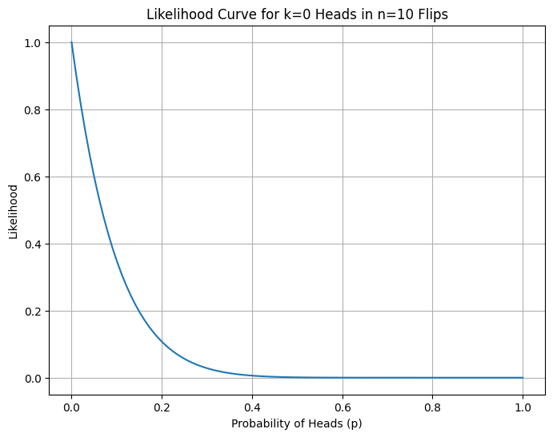
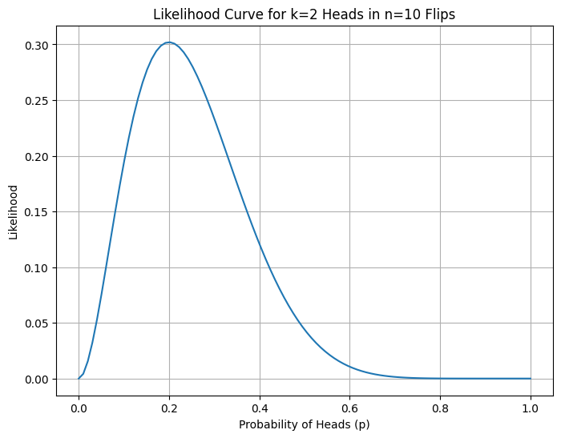
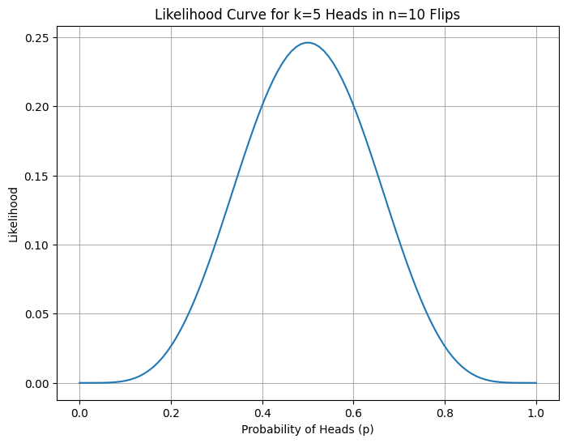
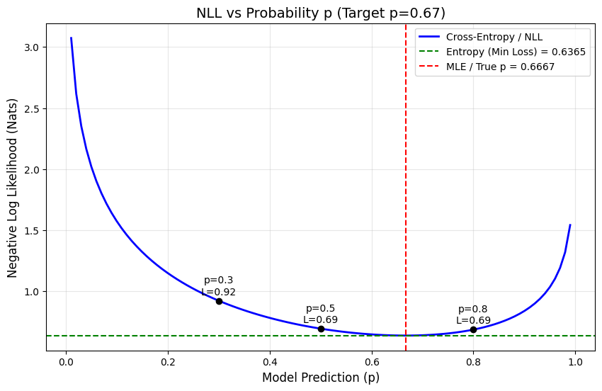
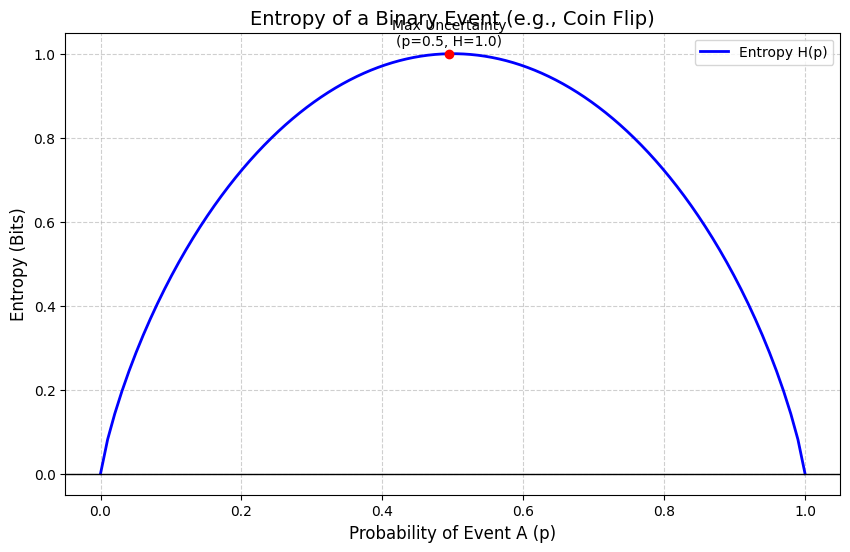

# Binary Cross Entropy from First Principles
We encounter binary cross-entropy loss a lot while working on deep learning classification problems. Often we use it like a black-box. I ignored the details because I thought these type of functions are very complex and have mathematical notions beyond my reasoning.  

But, upon study, I found out that this loss function has notably simple mathematical foundation: negative log-likelihood. Under the hood, it is a simple function that we use in order to do complex tasks.

This article takes us from basic probability to the cross-entropy loss function used in deep learning. This is an effort to reveal how seemingly complex optimization methods are built from first principles.

### A Simple Example
In most real world systems, we observe and then we infer. So, let's observe 12 coin flips:

$$x = [1,0,1,1,0,1,1,1,0,1,0,1]$$
1 represents success (say heads)

0 represents failure (say tails)

From top of our mind, we can say that the empirical probability seems to be `8/12 = 2/3 = 0.6667`.

Our objective isn't just to  calculate this manually. We want to derive the loss function that is able to guide an ML model to discover this underlying probability.

## Understanding the Building Blocks

Before we derive cross-entropy, let's understand its fundamental components. 

### What is a Probability Mass Function (PMF)?

Suppose we have a biased coin. A PMF that tells us "what are the chances?" for each possible outcome. It's a function that assigns probabilities to all possible outcomes of a discrete random variable.

For our coin example, the PMF is:

$$P(x \mid p) = p^{x} (1 - p)^{1 - x}$$

This formula is designed as a mathematical switch:

$$x = 1 \text{ (heads)}: P(x|p) = p^1 × (1-p)^0 = p$$

$$x = 0 \text{ (tails)}: P(x|p) = p^0 × (1-p)^1 = (1-p)$$

For any possible outcome, it tells you how likely that outcome is under the model.

A PMF is the probability distribution for a discrete random variable. It satisfies two conditions: P(x) ≥ 0 for all x, and ΣP(x) = 1 over all possible outcomes.

For Bernoulli trials, the PMF `P(x|p) = p^x(1-p)^(1-x)` encodes the probability. The parameter is `p` here. Depending on what we actually observe (heads or tails), the formula picks out the right probability value i.e p for heads or (1-p) for tails.

### What is Likelihood and Why Does it Matter for Loss?

The formula for likelihood is:

$$L(p) = \prod_{i=1}^{n} p^{x_i} (1-p)^{1-x_i}$$

Although probability and likelihood use the same formula, they are not the same thing.

**Probability** (forward direction): If we have a parameter p known, what's the chance of observing data x? Here parameter p is fixed and data x is variable. The question we ask is "If the coin has probability p = 0.7, what's the chance I see heads?"

**Likelihood** (reverse direction): If we have data observations x, how probable is a particular parameter value p for that observation? Here data x is fixed and parameter p is variable. The question we ask is "I saw 8 heads out of 12 flips. How likely is it that p = 0.7 vs p = 0.5?"

The formula is only a mathematical tool. Only our perspective changes. When we vary x with fixed p, we are thinking of probability. When we vary p with fixed x, we are thinking of likelihood. Both are same equations yet the variables are different.

Why is likelihood relevant to loss?

The likelihood function L(p) tells us how well a parameter value p explains our observed data. The higher the likelihood, the better p fits reality. In machine learning we observe data (fixed), we want to find model parameters (variable), and we adjust parameters for values that explain the observed data best.

Maximum Likelihood Estimation (MLE) = Minimizing Loss

When we maximize likelihood, we're finding parameters that fit our observed data really well. And when we minimize cross-entropy loss, we have the same objective. The loss is the negative log-likelihood, and minimizing the negative is equivalent to maximizing the positive.

This is why likelihood is foundational. The loss function is directly derived from the likelihood of our probabilistic model.

---

## From Likelihood to Log-Likelihood

For our i.i.d 12 coin flips, the likelihood is:

$$
L(p) = \prod_{i=1}^{n} p^{x_i}(1-p)^{1-x_i}
$$

Since we have 8 heads and 4 tails:

$$
L(p) = p^{8}(1 - p)^{4}
$$

The log-likelihood becomes:

$$
\ell(p)
= \log\!\left(p^{8}(1 - p)^{4}\right)
= 8 \log p + 4 \log(1 - p)
$$

More generally:

$$
\ell(p)
= k \log p + (n - k)\log(1 - p)
$$

Why take the logarithm?

Taking the logarithm provides mathematical convenience because products become sums, which are easier to work with. It also ensures numerical stability since many small probabilities when multiplied may cause underflow, and taking log prevents that. Finally, log is monotonic, so maximizing log L(p) is equivalent to maximizing L(p), which means the optimization preserves the same solution.

---

## Maximum Likelihood Estimation

To find the optimal p, we maximize ℓ(p) by taking its derivative and setting it to zero:

$$\frac{\partial \ell}{\partial p}
= \frac{k}{p} - \frac{n - k}{1 - p}
= 0$$

Solving:

$$k(1-p) = p(n-k)$$

$$k = np$$

$$\hat{p}_{\text{MLE}} = \frac{k}{n}$$

We can see that the calculation matches our intuition. The best estimate is p̂ = 8/12 = 0.6667.

This is the value of p that maximizes the likelihood of the observation. Meaning, for this value it is rational that we see the observation of 8 heads and 4 tails on 12 flips.

---

## From Maximum Likelihood to Minimum Loss

In deep learning, we frame problems as minimization rather than maximization. To convert:

$$\text{Maximize } (\ell(p)) \iff \text{Minimize } (-\ell(p))$$

Negation creates a minimization problem only when you start with a maximization problem. When we negate a function, we flip its direction of optimization: arg max f(x) ⟺ arg min -f(x). If x\* maximizes f(x), then f(x\*) ≥ f(x) for all x. Multiplying by -1 reverses the inequality so -f(x\*) ≤ -f(x) for all x. Therefore x\* minimizes -f(x).

We define the Negative Log-Likelihood (NLL), normalized by sample size. The normalization makes loss comparable across different dataset sizes. Without normalization, large datasets would have larger loss values and comparing it across datasets of different sizes would be harder. When we divide by n, we get average loss per sample.

$$NLL
= -\frac{1}{n}\,\ell(p)
= -\left[
\frac{k}{n}\log p
+ \frac{n - k}{n}\log(1 - p)
\right]$$

Substituting p̂ = k/n (the empirical probability from observed data):

$$NLL
= -\left[
\hat{p}\,\log p
+ (1 - \hat{p}) \log(1 - p)
\right]$$

**This is the Binary Cross-Entropy loss function H(p̂, p).**

Note: p̂ (p-hat) represents the empirical probability from our observed data. It's fixed once we collect data. The p without a hat is our model's prediction. This is what we're trying to optimize. Think of p̂ as what we saw and p as what our model currently guesses.

There could be one confusion. We just found the optimal p analytically (p̂ = k/n), so what's the point of defining a loss function? Here's what's happening. For this simple coin flip example, we could solve for p directly using calculus because we have a closed-form solution. But direct approach only works for very simple models. In real machine learning scenario for example to classify images, we have thousands of parameters that interact in complex, non-linear ways. There's no formula to solve for all of them at once. That's where the loss function becomes essential. By converting our maximum likelihood problem into a minimization problem (the NLL), we create something that gradient descent can work with. Gradient descent doesn't need to solve everything at once; it just needs to know which direction makes the loss smaller, then takes small steps in that direction on repeat. We're generalizing the principle behind it into a form that scales to other complex models.

In real machine learning models, probabilites are almost always conditional. Instead of estimating a single parameter p, we model P(y\|x,θ). The role of the loss function remains the same. We choose the parameters that assign high probability to the observed labels given the inputs.

---

## The Information Theory Connection

Cross-entropy actually came from information theory. Claude Shannon brought it forward in his book in 1948. 

### Entropy: Measuring Uncertainty

Entropy H(p̂) measures the inherent uncertainty in a distribution:

$H(\hat{p}) = -\sum_x \hat{p}(x)\,\log \hat{p}(x)$

For our binary case:

$H(\hat{p}) = -\left[\hat{p}\,\log \hat{p} + (1-\hat{p})\log(1-\hat{p})\right]$

With p̂ = 0.6667:  

$H(\hat{p}) \approx 0.6365\ \text{nats}$

This is the irreducible uncertainty in the data itself which represents the baseline amount of information needed to encode the outcomes. It could be said as the uncertainty prevalent in the data.

When you have a dataset but don't know the true underlying probability, you compute expectations using frequency of observation. The law of large numbers ensures that as n → ∞, the empirical expectation converges to the true expectation. So, observations help us learn expectation. But the true expectation is a property of the underlying probability distribution and is independent of any observations. For an analogy, the height of a mountain does not depend upon our measurement. But our knowledge of its height depends on measurements. As we take more measurements, our estimate converges to the true height. For our coin flip example, the true expectation isn't a property of the observations but of the coin itself.

### Cross-Entropy: Measuring Mismatch

Cross-Entropy H(p̂, p) measures the uncertainty when we use model distribution p to encode data from true distribution p̂:

$H(\hat{p}, p) = -\sum_x \hat{p}(x)\,\log p(x)$

Binary case:

$H(\hat{p}, p) = -\left[\hat{p}\,\log p + (1-\hat{p})\log(1-p)\right]$

When p = p̂ (perfect match), cross-entropy equals entropy. When p ≠ p̂, cross-entropy is higher.

### The Golden Equation

The relationship between these quantities is revealed through KL Divergence:

$\mathrm{KL}(\hat{p} \,\|\, p) = \sum_x \hat{p}(x)\,\log\frac{\hat{p}(x)}{p(x)}$

Expanding:

$\mathrm{KL}(\hat{p} \,\|\, p) 
= \sum_x \hat{p}(x)\log \hat{p}(x) - \sum_x \hat{p}(x)\log p(x)
= -H(\hat{p}) - \big(-H(\hat{p}, p)\big)$

Rearranging:

$$H(\hat{p}, p) = H(\hat{p}) + \mathrm{KL}(\hat{p}\,\|\,p)$$

Since the entropy H(p̂) is constant, minimizing cross-entropy is equivalent to minimizing KL divergence. KL divergence is the distance between the true and model distributions.

---

## Numerical Example: The Loss Landscape

Let's compute cross-entropy for different model predictions, with true p̂ = 0.6667 and baseline entropy H(p̂) ≈ 0.6365:

| Model p | Status   | Cross-Entropy | KL Divergence |
|---------|----------|---------------|---------------|
| 0.30    | Wrong    | 0.922         | 0.286         |
| 0.50    | Neutral  | 0.693         | 0.057         |
| 0.67    | Optimal  | 0.637         | 0.000         |
| 0.80    | Close    | 0.685         | 0.049         |

Cross-entropy minimizes when p = p̂. At the minimum, KL divergence = 0 which means distributions match. Wrong predictions like p = 0.3 incur much higher loss. The loss landscape is convex, guaranteeing a unique global minimum.

---

## Extension to Multiclass Classification

Everything we've developed generalizes naturally from binary (C=2) to multiclass (C>2) problems.

Instead of scalar probabilities, we use one-hot vectors. Ground truth is y = [y₁, y₂, ..., yc] where only one element is 1 and rest are 0. Prediction is ŷ = [ŷ₁, ŷ₂, ..., ŷc] where Σŷc = 1.

### Generalized PMF

For a single observation, the probability is:

$P(y \mid \hat{y}) = \prod_{c=1}^{C} (\hat{y}_c)^{y_c}$

Since y is one-hot, if c is the correct class where yc = 1, it contributes ŷc. If c is incorrect where yc = 0, it contributes (ŷc)⁰ = 1.

### Derivation

Taking the log-likelihood:

$$
\ell(\hat{y})
= \log\!\left[\prod_{c=1}^{C} (\hat{y}_c)^{y_c}\right]
= \sum_{c=1}^{C} y_c \log \hat{y}_c
$$

Negating for loss:

$\mathrm{CE}(y, \hat{y}) = -\sum_{c=1}^{C} y_c \,\log \hat{y}_c$

This is the Categorical Cross-Entropy used in multiclass classification.

Note: When C = 2, this collapses back to binary cross-entropy, confirming our framework is consistent.

---

## Final Insight and Conclusion
Minimizing cross-entropy is equivalent to minimizing the KL divergence between reality and your model. After applying gradient descent steps to update and optimize parameters, our model moves closer to the true data distribution. This move is guided by the cross-entropy loss function which is now clear that it is a simple mathematical construct.

A loss curve decreasing during neural network training means we're witnessing maximum likelihood estimation at work. That complex model, with its millions of parameters, is doing fundamentally the same thing as finding the best estimate of a coin's bias from a handful of flips.

The tools we use for the most sophisticated AI systems are built on foundations that are both simple and profound. Cross-entropy isn't some abstract and difficult function, it's a simple mathematical derivation. And that's what makes it powerful.

---

## References

1. Shannon, C.E. (1948). "A Mathematical Theory of Communication." *Bell System Technical Journal*, 27(3), 379-423.

2. Shlens, J. (2014). "Notes on Kullback-Leibler Divergence and Likelihood." *arXiv preprint arXiv:1404.2000*.  
3. Brownlee, J. (2020). "A Gentle Introduction to Cross-Entropy for Machine Learning." MachineLearningMastery.com. Retrieved from https://machinelearningmastery.com/cross-entropy-for-machine-learning/
4. Wikipedia contributors. (n.d.). "Cross-entropy." Wikipedia, The Free Encyclopedia. Retrieved January 06, 2026, from https://en.wikipedia.org/wiki/Cross-entropy

---