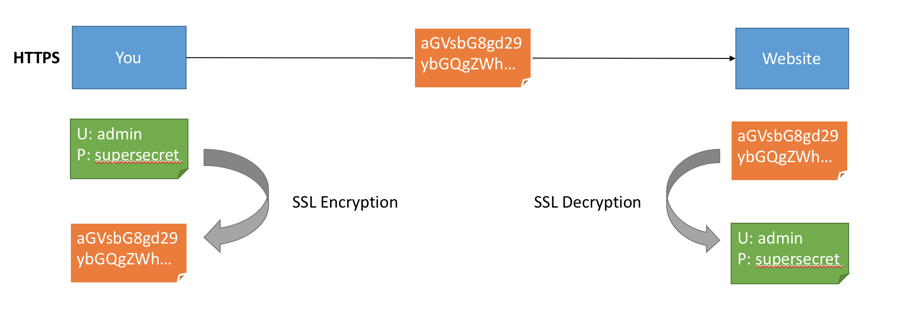

# Encryption (SSL)

Encryption solves the problem of the man in the middle (MITM) attack. That’s because your packets, while being routed to your destination, travel your network 
and hop from machines to machines. If your data is PLAINTEXT, any of these routers could read the content of the data 
you’re sending.



After Encryption is enabled and SSL certificates being carefully setup, your data is now encrypted and securely transmitted over the network. With SSL, only the first 
and the final machine possess the ability to decrypt the packet being sent.

## Steps to generate SSL certificates

#### 1. Generate SSL key and certificate for each node

The first step of deploying one or more nodes with the SSL support is to generate the key and the certificate for each machine in the cluster. You can use Java's 
keytool utility to accomplish this task. We will generate the key into a temporary keystore initially so that we can export and sign it later with CA.

```
keytool -genkey -keyalg RSA -keystore {keystore-name}.jks -storepass {store-password} -keypass {key-password} -validity {validity} -alias {alias-name} -dname CN={node-fqdn}
```
**You need to specify six parameters in the above command**
    
- keystore-name: Name of the keystore, this file contains the private key of the certificate; therefore, it needs to be kept safely.
- store-pass: Password for the store of certificate.
- key-pass: Password for the key of certificate.
- validity: The valid time for the certificate in days.
- alias: Alias name for the certificate, e.g: localhost/node(hostname)
- node-fqdn: FQDN of the node; it is used later to communicate with other nodes in a cluster.

The following command can be run afterwards to verify the contents of the generated certificate:
```
keytool -list -v -keystore {keystore-name}.jks
```

#### 2. Creating your own CA (Certificate Authority)

After the first step, each machine in the cluster has a public-private key pair, and a certificate to identify the machine. The certificate, however, is 
unsigned, which means that an attacker can create such a certificate to pretend to be any machine.

Therefore, it is important to prevent forged certificates by signing them for each machine in the cluster. A certificate authority (CA) is responsible for 
signing certificates. CA works likes a government that issues passports—the government stamps (signs) each passport so that the passport becomes difficult to 
forge. Other governments verify the stamps to ensure the passport is authentic. Similarly, the CA signs the certificates, and the cryptography guarantees that 
a signed certificate is computationally difficult to forge. Thus, as long as the CA is a genuine and trusted authority, the clients have high assurance that 
they are connecting to the authentic machines.

```
openssl req -new -x509 -keyout ca-key -out ca-cert -days {validity} -passout pass:{ca-pass} -subj "/CN={sever-fqdn}"
```

**You need to specify three parameters in the above command**

- validity: The valid time for the CA certificate in days
- ca-pass: Password for the CA certificate
- server-fqdn: CA Server FQDN

#### 3. Create a Truststore

In contrast to the keystore in step 1 that stores each machine's own identity, the truststore of a client stores all the certificates that the client should 
trust. Importing a certificate into one's truststore also means trusting all certificates that are signed by that certificate. As the analogy above, 
trusting the government (CA) also means trusting all passports (certificates) that it has issued. 

This attribute is called the chain of trust, and it is 
particularly useful when deploying SSL on a large cluster. You can sign all certificates in the cluster with a single CA, and have all machines share the same 
truststore that trusts the CA. That way all machines can authenticate all other machines.

Add the generated CA to the **clients' truststore** so that the clients can trust this CA.

```
keytool -keystore {truststore-name}.jks -storepass {store-pass} -alias CARoot -import -file ca-cert -noprompt
```

**You need to specify two parameters in the above command**

- truststore-name: Name for the Truststore e.g: truststore.jks
- store-pass: Store password for the Truststore

#### 4. Signing the certificate

The next step is to sign all certificates generated by step 1 with the CA generated in step 2. 

First, you need to export the certificate from the keystore:

```
keytool -keystore {keystore-name}.jks -certreq -file cert-file -storepass {store-pass} -keypass {key-pass} -alias {node-alias}
```

**You need to specify five parameters in the above command**

- keystore-name: Node Keystore to extract certificate
- cert-file: Unsigned Certificate of the Keystore
- store-pass: Store pass of the Keystore
- key-pass: Key pass of the Keystore
- node-alias: Alias name of the Keystore e.g: localhost/node(hostname)

Then sign it with the CA:

```
openssl x509 -req -CA ca-cert -CAkey ca-key -in cert-file -out cert-signed -days {validity} -CAcreateserial -passin pass:{ca-pass}
```

**You need to specify six parameters in the above command**

- ca-cert: CA cert file 
- ca-key: CA key file
- cert-file: Unsiged certificate of Keystore
- cert-signed: signed certificate of keystore
- validity: The valid time for the Signed certificate in days
- ca-pass: Password of the CA

#### 5. Import Signed Certificate

Finally, you need to import both the certificate of the CA and the signed certificate into the keystore:

```
keytool -keystore {keystore-name}.jks -storepass {store-pass} -keypass {key-pass} -alias CARoot -import -file ca-cert -noprompt

keytool -keystore {keystore-name}.jks -storepass {store-pass} -keypass {key-pass} -alias {node-alias} -import -file cert-signed -noprompt
```

**You need to specify six parameters in the above command**

- keystore-name: the location of the keystore
- store-pass: Store pass of the Keystore
- key-pass: Key pass of the Keystore
- node-alias: Alias name of the Keystore
- ca-cert: CA certificate
- cert-signed: Signed certificate of the Keystore

---

Here is an example of a bash script with all above steps. Note that one of the commands assumes a password of `test1234`, so either use that password or edit 
the command before running it.

```
#!/bin/bash
PASSWORD=test1234
VALIDITY=365
CN=node.domain.com
KEYSTORE_ALIAS=node
CA_ALIAS=CARoot

# for server

# generating CA
openssl req -new -x509 -keyout ca-key -out ca-cert -days $VALIDITY -passout pass:$PASSWORD -subj /CN=$CN
# generating server keystore
keytool -genkey -keyalg RSA -keystore kafka.server.keystore.jks -validity $VALIDITY -storepass $PASSWORD -keypass $PASSWORD -alias $KEYSTORE_ALIAS -dname CN=$CN
# generating server truststore and importing CA certificate in it
keytool -keystore kafka.server.truststore.jks -storepass $PASSWORD -alias $CA_ALIAS -import -file ca-cert -noprompt
# exporting server certificate from server keystore
keytool -keystore kafka.server.keystore.jks -certreq -file cert-file -alias $KEYSTORE_ALIAS -storepass $PASSWORD -keypass $PASSWORD
# signing server certificate with CA
openssl x509 -req -CA ca-cert -CAkey ca-key -in cert-file -out cert-signed -days $VALIDITY -CAcreateserial -passin pass:$PASSWORD
# importing CA certificate in server keystore
keytool -keystore kafka.server.keystore.jks -alias $CA_ALIAS -import -file ca-cert -storepass $PASSWORD -keypass $PASSWORD -noprompt
# importing Signed server certificate in server keystore
keytool -keystore kafka.server.keystore.jks -alias $KEYSTORE_ALIAS -import -file cert-signed -storepass $PASSWORD -keypass $PASSWORD -noprompt
```